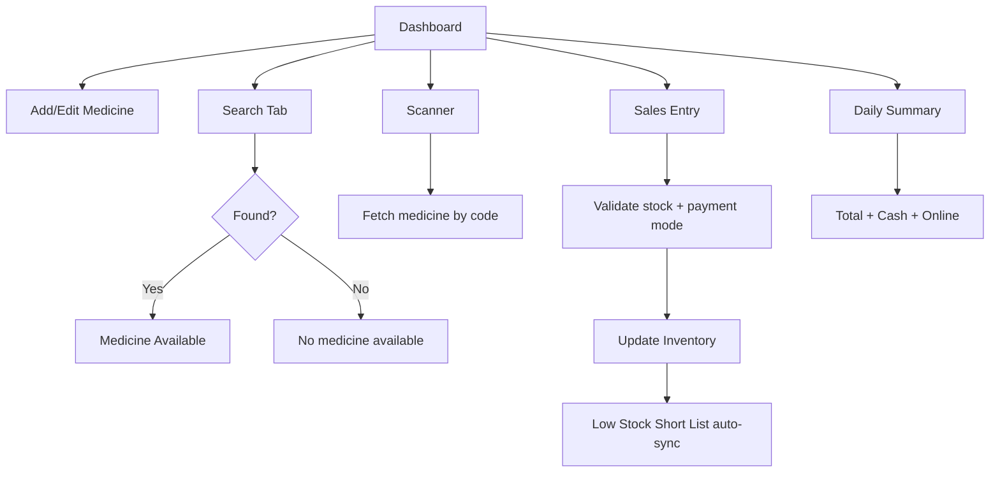

# Phase 1 — Requirement Finalization & Workflow Mapping (Completed)

## Finalized Roles
- **Owner/Admin**: full access across medicine, stock, sales, reporting, and user governance.
- **Pharmacist**: medicine + batch + stock updates, search/scan operations, sales support.
- **Staff/Billing**: search, scan, sales entry, and daily summary viewing.

## Finalized Medicine Master Fields
- Medicine Name
- Generic/Composition
- Brand
- Manufacturer
- Batch No.
- MFG Date
- EXP Date
- Quantity/Stock
- Price/Rate
- Label/Notes
- QR/Code value

## Finalized Modules
- Dashboard
- Add/Edit Medicine
- Search Tab
- Scanner
- Short List (Low Stock)
- Sales Entry
- Daily Sales & Payment Summary

## Confirmed Workflow Rules
1. Search returns `Medicine Available` when matched, else `No medicine available`.
2. Quantity `<= 3` appears automatically in Short List.
3. Sale entry requires sold units and payment mode.
4. Batch EXP must be greater than MFG.
5. Sold quantity must not exceed stock.

## UX Wireframe Flow (Textual)

